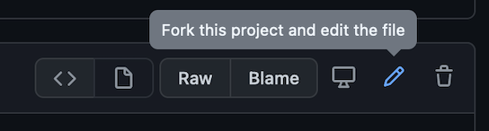
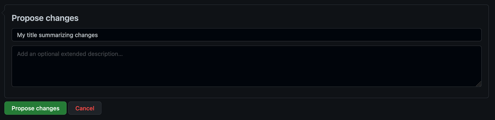

# Start contributing

Once you have [created your GitHub account](overview.md#github-account), you can begin interacting with the help content on [GitHub](https://github.com).  Learn more below about editing files directly, reporting issues, and providing feedback.

## Making quick fixes

If you notice a small error or an opportunity to improve clarity with a minor change, you can provide changes for review directly from your web browser.  This process is best for changes that can be done quickly and would often take longer to submit an issue than simply propose the fix.  This is the ideal way to contribute!

1. All pages that are open-sourced will have an **Edit this page** link displayed at the bottom of the page.  Clicking this link will navigate directly to GitHub and display the content of the page.

    :::note
    If there is no link visible, then this page is not managed by open-sourced markdown content on GitHub and is not open for collaboration.  Please use standard protocols for submitting change requests.
    :::

2. Click the pencil icon to fork the project and edit the file.

    :::info
    You must be logged into GitHub to propose changes.
    :::

    

3. Perform any changes to the markdown directly in your web browser.

4. Give your proposed change a title and description.  Scroll to the bottom of the page and click the green **Propose file change** button.

    

5. Create a **pull request**.  This is the object that encapsulates your changes and will be reviewed by SMA for acceptance to merge your changes into the live documentation.  Enter a title and click the green **Create pull request** button.  SMA team members will be notified of your request and will review your changes, possibly provide feedback, and may approve your request.

    

## Reporting issues

If you are unsure how to fix a problem or are not confident in your ability to perform the work, just report it!  Follow [GitHub's creating an issue documentation](https://docs.github.com/en/issues/tracking-your-work-with-issues/creating-an-issue) for the procedures.  Add as much detail as you can to eliminate further research on the issue being required.

## Review proposed changes

A great way to get involved is to review others' proposed changes.  You can navigate to the page of any repositories that interest you and look at open requests.  Add a review, comments, or both, and let us know what you think about the proposed changes!
